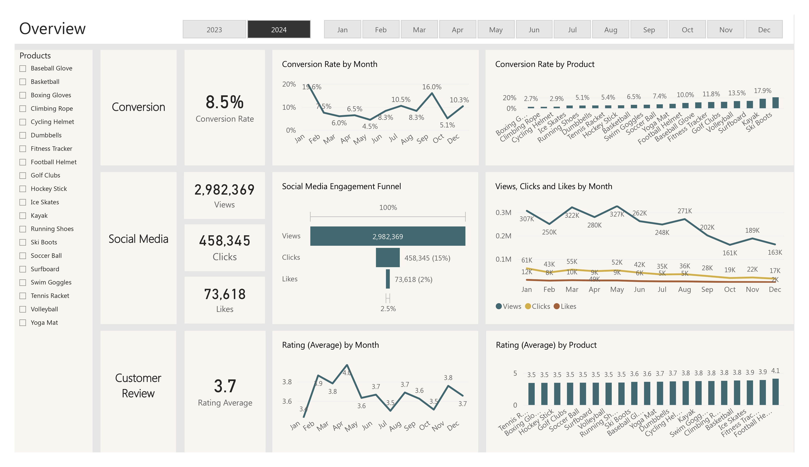
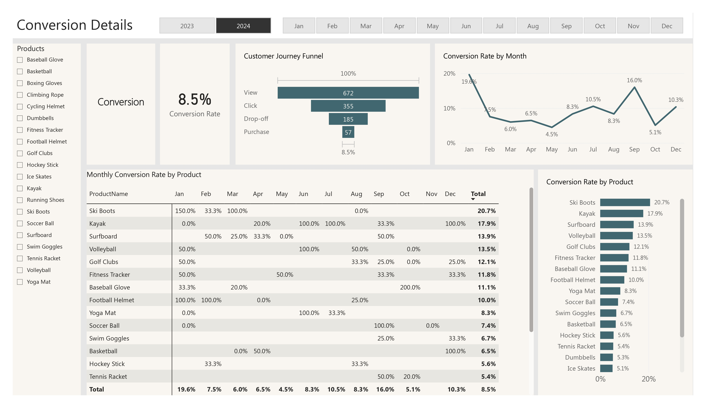
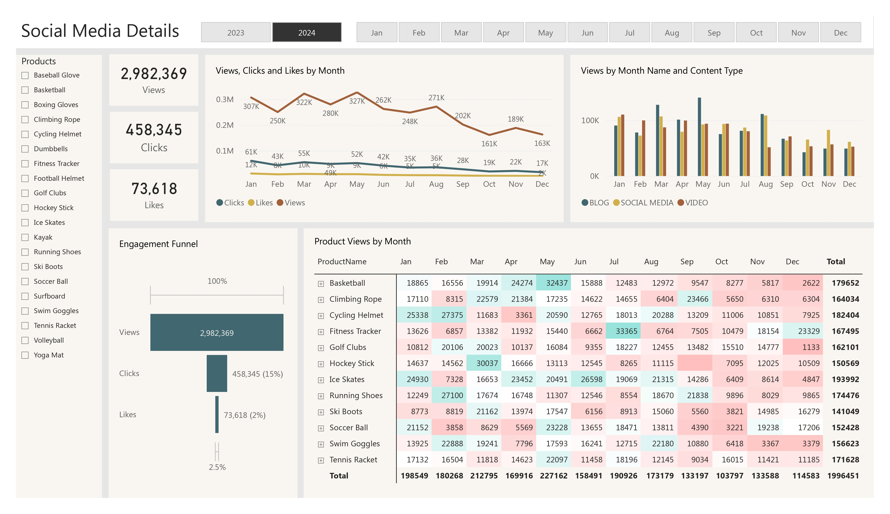
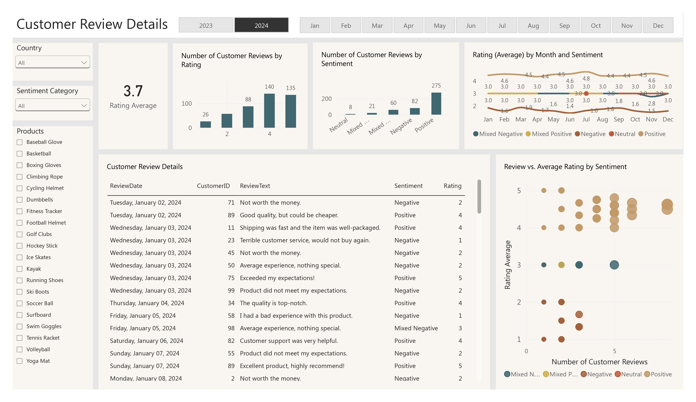

# Marketing Analytics Project

An end-to-end marketing analytics portfolio project built with **Microsoft SQL Server, SQL, Python, NLTK VADER, Power BI, DAX, and Power BI Service**.

This project demonstrates a complete analytics workflow, starting from restoring and preparing a SQL Server database, creating analytical SQL views, performing customer sentiment analysis in Python, building a data model in Power BI, developing a four-page interactive report, publishing the report to Power BI Service, and presenting business insights, goals, actions, and recommendations.

---

## Project Overview

The purpose of this project is to analyze marketing performance across customer behavior, product performance, social media engagement, conversion activity, and customer feedback.

The project follows a complete business intelligence workflow:

**SQL Server Database → SQL Data Cleaning & Views → Python Sentiment Analysis → Power BI Data Model → Dashboard Development → Power BI Service → Business Presentation**

The final solution combines structured database analysis, natural language sentiment analysis, interactive data visualization, and business recommendations.

---

## Business Objectives

The project was designed to answer key business questions such as:

- What is the overall marketing conversion performance?
- Which products and months have the strongest or weakest conversion rates?
- How does social media engagement change over time?
- Which content types generate the most audience views?
- What do customer ratings and written reviews reveal about customer satisfaction?
- What is the distribution of positive, negative, neutral, and mixed customer sentiment?
- Where are customers dropping off in the conversion journey?
- What actions can be taken to improve conversion, engagement, and customer satisfaction?

---

## Tools & Technologies

- **Microsoft SQL Server / SSMS** – database restoration, data cleaning, transformation, and SQL views
- **SQL** – data preparation and analytical view creation
- **Python** – customer review sentiment analysis
- **Pandas** – data handling and transformation
- **PyODBC** – SQL Server connection from Python
- **NLTK VADER** – natural language sentiment analysis
- **Microsoft Power BI Desktop** – data modeling, DAX, analysis, and visualization
- **DAX** – calendar table and time-intelligence support
- **Power BI Service** – publishing and sharing the completed report

---

# Project Workflow

## 1. Restore the Source Database in SQL Server

The project starts with the original SQL Server database backup:

`database_backup/MarketingAnalytics.bak`

The backup file was restored in **SQL Server Management Studio (SSMS)** and used as the primary data source for the project.

After restoring the database, the source data was reviewed, cleaned, and prepared using SQL.

---

## 2. SQL Data Cleaning and Transformation

Data cleaning and transformation were performed in SQL Server before the data was imported into Power BI.

After preparing the data, several SQL **views** were created to organize the dataset into dimension and fact structures for analysis.

The SQL queries were saved according to their corresponding dimension and fact view names.

### Dimension Views

- `sql/dim_customers.sql`
- `sql/dim_products.sql`

### Fact Views

- `sql/fact_customer_journey.sql`
- `sql/fact_customer_reviews.sql`
- `sql/fact_engagement_data.sql`

These views were later imported into Power BI and used to build the analytical data model.

---

## 3. Python Customer Sentiment Analysis

After the SQL preparation stage, Python was connected directly to the SQL Server database using **PyODBC**.

The customer review data was retrieved from SQL Server and analyzed using:

- Pandas
- PyODBC
- NLTK
- VADER SentimentIntensityAnalyzer

The Python workflow:

1. Connected Python to the SQL Server database.
2. Retrieved customer review data.
3. Processed review text.
4. Calculated VADER compound sentiment scores.
5. Created customer sentiment categories.
6. Created sentiment score buckets.
7. Exported the enriched review data to CSV.

The output file is:

`data/customer_reviews_with_sentiment.csv`

This CSV was later imported into Power BI specifically for customer sentiment analysis and visualization.

---

## 4. Power BI Data Import

Two main data sources were used in Power BI:

### SQL Server Views

The dimension and fact views created in SQL Server were imported directly into Power BI.

### Python Sentiment Dataset

The sentiment analysis output was imported from:

`data/customer_reviews_with_sentiment.csv`

This allowed the Power BI report to combine structured marketing data from SQL Server with customer sentiment information generated in Python.

---

## 5. Power BI Data Modeling

A structured data model was created in Power BI by establishing relationships between the dimension tables and fact tables.

The model was designed to support analysis across:

- Customers
- Products
- Customer journey activity
- Customer reviews
- Social media engagement
- Conversion performance
- Time Intelligence

A dedicated **Calendar table** was also created using DAX to support date filtering
The DAX script is stored in:

`PowerBI/Calendar_Table_DAX_Script.txt`

The Calendar table was connected to the relevant model tables so that the report could perform consistent year, month, and time-based analysis.

---

## 6. Power BI Dashboard Development

After completing the data model, a four-page interactive Power BI report was developed.

The Power BI file is located at:

`PowerBI/Marketing_Analytics_Dashboard.pbix`

The report contains the following pages:

1. **Overview**
2. **Customer Review Details**
3. **Social Media Details**
4. **Conversion Details**

---

## Dashboard Pages

### 1. Overview



The Overview page provides a high-level summary of marketing performance, including:

- Overall conversion rate
- Monthly conversion trend
- Conversion rate by product
- Social media views
- Social media clicks
- Social media likes
- Social media engagement funnel
- Average customer rating
- Monthly rating trend
- Product-level rating performance

### 2. Conversion Details



This page focuses on customer feedback and sentiment analysis.

It includes:

- Average customer rating
- Number of reviews by rating
- Number of reviews by sentiment
- Monthly rating trends by sentiment
- Customer review details
- Review text
- Sentiment categories
- Rating analysis
- Review vs. average rating by sentiment

This page combines customer review information with the sentiment analysis produced in Python.

### 3. Social Media Details



This page analyzes marketing engagement across social media and content activity.

It includes:

- Total views
- Total clicks
- Total likes
- Monthly views, clicks, and likes
- Engagement funnel
- Views by content type
- Product views by month
- Product-level engagement trends

### 4. Customer Review Details



This page analyzes customer journey and conversion performance.

It includes:

- Overall conversion rate
- Customer journey funnel
- Monthly conversion rate
- Monthly conversion rate by product
- Conversion rate by product
- High-performing and low-performing products

---

## 7. Power BI Service

After completing the report in Power BI Desktop, the final dashboard was published to **Power BI Service**.

This demonstrates the complete reporting workflow from local development to cloud-based report publishing and sharing.

---

## Key Insights

- The overall conversion rate is approximately **8.5%**.
- January recorded the highest overall monthly conversion rate at **19.6%**.
- May recorded the lowest overall monthly conversion rate at **4.5%**.
- Conversion recovered to **10.3% in December** after falling to **5.1% in October**.
- Social media generated approximately **2.98 million views**, **458K clicks**, and **73K likes**.
- Social media views declined during the later part of the year, indicating weaker audience engagement.
- Blog content generated strong view performance, particularly in key months such as March and May.
- The average customer rating is approximately **3.7 out of 5**.
- Positive sentiment represents the largest customer sentiment category.
- Mixed and negative reviews provide opportunities for customer experience improvement.

---

## Goals, Actions, and Recommendations

### Increase Conversion Rates

**Goal:** Identify the factors affecting conversion performance and determine where improvement opportunities exist.

**Recommended Actions:**

- Focus marketing efforts on high-performing products.
- Use seasonal promotions and targeted campaigns during strong-performing periods.
- Investigate lower-performing months and adjust marketing strategies accordingly.
- Analyze customer journey drop-off points and improve funnel performance.

### Enhance Customer Engagement

**Goal:** Understand which content and marketing activities generate the strongest engagement.

**Recommended Actions:**

- Refresh the content strategy during lower-engagement periods.
- Experiment with more engaging content formats.
- Improve call-to-action placement.
- Use content-type performance to guide future campaign planning.
- Focus additional attention on months where engagement historically declines.

### Improve Customer Feedback Scores

**Goal:** Understand customer feedback patterns and identify opportunities to improve customer satisfaction.

**Recommended Actions:**

- Analyze mixed and negative reviews for recurring customer concerns.
- Develop improvement plans based on common issues.
- Monitor sentiment alongside star ratings.
- Use customer feedback trends to guide product and service improvements.

---

## Business Presentation

A separate portfolio presentation was created to communicate the analytical findings to business stakeholders.

The presentation includes:

- Key insights
- Conversion analysis
- Customer engagement analysis
- Customer feedback analysis
- Business goals
- Recommended actions
- Business recommendations

Presentation file:

`Presentation/Marketing_Analytics_Portfolio_Presentation.pdf`

---

## Project Structure

```text
Marketing-Analytics-Project/
│
├── database_backup/
│   └── MarketingAnalytics.bak
│
├── data/
│   └── customer_reviews_with_sentiment.csv
│
├── images/
│   ├── 01_Overview_Dashboard.jpg
│   ├── 02_Customer_Review_Details.jpg
│   ├── 03_Social_Media_Details.jpg
│   └── 04_Conversion_Details.jpg
│
├── PowerBI/
│   ├── Marketing_Analytics_Dashboard.pbix
│   └── Calendar_Table_DAX_Script.txt
│
├── Presentation/
│   └── Marketing_Analytics_Portfolio_Presentation.pdf
│
├── Python/
│   └── customer_review_sentiment_analysis.py
│
├── sql/
│   ├── dim_customers.sql
│   ├── dim_products.sql
│   ├── fact_customer_journey.sql
│   ├── fact_customer_reviews.sql
│   └── fact_engagement_data.sql
│
├── README.md
├── requirements.txt
└── tools_used.txt
```

---

## Main Project Files

### Original SQL Server Database

`database_backup/MarketingAnalytics.bak`

Contains the original SQL Server database used as the starting point for the project.

### SQL Scripts

`sql/`

Contains the SQL queries used to prepare and create the dimension and fact views used in the analytical model.

### Python Sentiment Analysis

`Python/customer_review_sentiment_analysis.py`

Contains the Python workflow used to retrieve customer review data from SQL Server and perform VADER sentiment analysis.

### Sentiment Analysis Dataset

`data/customer_reviews_with_sentiment.csv`

Contains the customer review data enriched with Python-generated sentiment analysis results.

### Power BI Dashboard

`PowerBI/Marketing_Analytics_Dashboard.pbix`

Contains the complete four-page interactive Power BI report and data model.

### Calendar Table DAX Script

`PowerBI/Calendar_Table_DAX_Script.txt`

Contains the DAX code used to create the Calendar table for time-based analysis.

### Portfolio Presentation

`Presentation/Marketing_Analytics_Portfolio_Presentation.pdf`

Contains the final business presentation with key findings, goals, actions, and recommendations.

---

## Python Requirements

The Python dependencies used in the project are listed in:

`requirements.txt`

Install them with:

```bash
pip install -r requirements.txt
```

Main Python libraries:

```text
pandas
pyodbc
nltk
```

---

## Skills Demonstrated

This project demonstrates practical experience in:

- End-to-End Data Analytics
- Microsoft SQL Server
- SQL Server Management Studio
- Database Restoration
- SQL Data Cleaning
- SQL Data Transformation
- SQL Views
- Dimension and Fact Table Design
- Python Data Analysis
- Pandas
- PyODBC
- NLP Sentiment Analysis
- NLTK VADER
- CSV Data Preparation
- Power BI Data Import
- Data Modeling
- Table Relationships
- DAX
- Calendar Tables
- Power BI Dashboard Development
- Data Visualization
- KPI Analysis
- Marketing Analytics
- Customer Review Analysis
- Social Media Analytics
- Conversion Analysis
- Business Insight Generation
- Data Storytelling
- Power BI Service Publishing
- Business Recommendations

---

## End-to-End Process Summary

```text
MarketingAnalytics.bak
        ↓
Restore Database in SQL Server / SSMS
        ↓
SQL Data Cleaning & Transformation
        ↓
Create Dimension and Fact Views
        ↓
Save SQL View Queries
        ↓
Connect Python to SQL Server
        ↓
Customer Review Sentiment Analysis
        ↓
Export customer_reviews_with_sentiment.csv
        ↓
Import SQL Views + Sentiment CSV into Power BI
        ↓
Build Dimension / Fact Data Model
        ↓
Create & Connect DAX Calendar Table
        ↓
Build Four-Page Power BI Report
        ↓
Publish to Power BI Service
        ↓
Create Business Presentation
        ↓
Key Insights + Goals + Actions + Recommendations
```

---

## Author

**Microsoft Certified Power BI Data Analyst**

Core skills demonstrated in this project include **Power BI, SQL, Python, Data Modeling, Data Visualization, Marketing Analytics, Sentiment Analysis, and Business Intelligence**.
